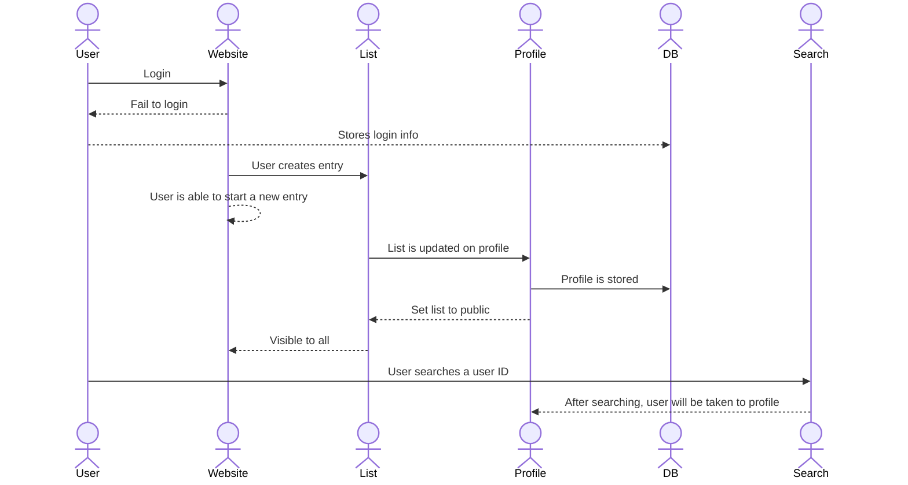

# Koob

[My Notes](notes.md)

Koob is a fresh, innovative take on media rating site, allowing the user essentially complete freedom to upload titles and works and compile them into lists, whether books, poetry, comics, and more. The ease of upload allows any user to create and rate entries immediately after reading them, as well as compile a comprehensive list of anything they might have already read, giving users a hub for their literature and a way to track and rate their literary journey. Unlike traditional review sites that limit what can be submitted or emphasize only popular titles, Koob offers complete freedom for uploads, ensuring that every piece of literature has a place, no matter how niche.

Koob also allows users to search for others' profiles, opening up a way for readers to be exposed to new literature and writers, as well as see others' thoughts on those titles. The comment feature gives a more immersive experience to the user, in addition to the numerical rating system, further giving freedom to the user to create the lists and rankings that might only be inside of their heads.

> [!NOTE]
>  This is a template for your startup application. You must modify this `README.md` file for each phase of your development. You only need to fill in the section for each deliverable when that deliverable is submitted in Canvas. Without completing the section for a deliverable, the TA will not know what to look for when grading your submission. Feel free to add additional information to each deliverable description, but make sure you at least have the list of rubric items and a description of what you did for each item.

> [!NOTE]
>  If you are not familiar with Markdown then you should review the [documentation](https://docs.github.com/en/get-started/writing-on-github/getting-started-with-writing-and-formatting-on-github/basic-writing-and-formatting-syntax) before continuing.

## 🚀 Specification Deliverable

> [!NOTE]
>  Fill in this sections as the submission artifact for this deliverable. You can refer to this [example](https://github.com/webprogramming260/startup-example/blob/main/README.md) for inspiration.

For this deliverable I did the following. I checked the box `[x]` and added a description for things I completed.

- [x] Proper use of Markdown
- [x] A concise and compelling elevator pitch
- [x] Description of key features
- [x] Description of how you will use each technology
- [x] One or more rough sketches of your application. Images must be embedded in this file using Markdown image references.

### Elevator pitch

Have you ever wanted a simple, conveneient way to not only rate what you read, but see what other people think about the same book? Introducing Koob, a website where you can upload any and all books, comics, poetry, and more, all to be rated and even commented on by the user. Unlike other rating sites, this gives complete freedom for uploads, allowing for all literature to be included, as well as a personal ranking system, where you can compile a list of all of your favorite media and how they rank amongst others of their type.

### Design

This would be the design flow of the website:

### Key features
- Able to create an entry for any piece of media and rate it
- Images associated with each entry
- Able to create a list of any one type of media and rank each entry in the list
- Able to add a numerical rating to each entry, as well as a comment

### Technologies

I am going to use the required technologies in the following ways.

- **HTML** - The structure of the weebsite will be as follows: Across the very top will be the title of the website. A little below that will be a header, telling which section of the website someone is in (i.e., Upload, List, etc.). Then, a small paragraph outlining what goes on in each link (i.e., the upload section would have something like "Choose a title for your work, as well as a picture, and then give it a ranking and/or a comment!"). HTML will be used to display whatever image the user uploads as part of the entry. Finally, on a bar across the top will be the links created by HTML to take the user to the different sections of the site. Thesse will include "Entry/upload" to make a new entry, "Lists" to show all the lists a user has created and be able to edit them, and "Profile" to show the users site information, as well as their lists publicly (unless specified otherwise). There will be a search bar to find specific users and their profiles.

- **CSS** - I will use Lucida Console fixed font throughout the website. I will use a dark forest green, white, and a gold-ish yellow. The buttons will be rectangular, with rounded corners. There will be partitions between each of the links, as well as the header and title. This will also allow for me to change the color of the font for the rating itself (which will be 1-10), with each rating being a different color, progressing from red (at 1) up to green (at 10).

- **React** - I will use react for a react router, which will let me have the multiple pages that I would need for each of the links. I will have a tally that will update with each new entry, showing how many a user has for each list. In the lists section, there will be an option to edit or delete an entry. There will also be a way to login. Lists can also be set to public or private.

- **Service** - Backend service with endpoints for:
    - Login
    - Submitting entry
    - Receiving entry
    - Updating lists publically and privately

- **DB/Login** - This will store the users, entries, and lists. It will allow users to register and login. Credentials will be securely stored in the database. Entries cannot be created unless the user is logged in. Lists associated with users will also be stored in the database.

- **WebSocket** - As the users create entries, they will be public on their profiles for others to view via searching the profile.

## 🚀 AWS deliverable

For this deliverable I did the following. I checked the box `[x]` and added a description for things I completed.

- [x] **Server deployed and accessible with custom domain name** - [My server link](https://startup.koob.click).

## 🚀 HTML deliverable

For this deliverable I did the following. I checked the box `[x]` and added a description for things I completed.

- [x] **HTML pages** - Six different pages: Login (index), Profile, profile editor, entry upload, about, and list page
- [x] **Proper HTML element usage** - I spent alot of time figuring out the different elements, especially span, ul, ol, selectors, inputs, img, a, and many others.
- [x] **Links** - I have links going to all of my different pages, all available from every page (except for edit profile, which is only in the profile section).
- [x] **Text** - All of my pages have text on them, the most being on the About page.
- [x] **3rd party API placeholder** - I have a placeholder for a book recommendation third party generator on the About page
- [x] **Images** - I have images on the list page (as well as the ability to upload them on the Entry page), an image in the About page, and a profile picture for the Profile page
- [x] **Login placeholder** - I have a long in placeholder on the index (home) page
- [x] **DB data placeholder** - List page contains the entries that will be stored on a database (they are hardcoded for now)
- [x] **WebSocket placeholder** - On the profile page, adding an entry or list will update numbers in the nio, as well as display the lists if the account is Public

## 🚀 CSS deliverable

For this deliverable I did the following. I checked the box `[x]` and added a description for things I completed.

- [x] **Header, footer, and main content body** - I used a common CSS file to style these `Main.css`. The views specific things are in `About.css`, 'List.css', 'Entry_upload.css,' 'index.css,' 'Profile.css', 'Profile_edit.css', and 'Create_login.css.'

- [x] **Navigation elements** - Bootstrap navbar, along with css elements to stylize it. There are also certain buttons within some of the pages that will take you to different parts (i.e., the Create Account button, Create list button, etc.)

- [x] **Responsive to window resizing** - Bootstrap and `display:flex'

- [x] **Application elements** - Utilized 'display:flex' to organize the elements of my website, as well as ordered and unordered lists for certain parts of it (the List and Profile sections especially)

- [x] **Application text content** - Text is whatever is asociated with Bootstrap, give sa nice uniform look across the site.

- [x] **Application images** - I have all of the images as they are, some with borders around them to add a bit of flare.

## 🚀 React part 1: Routing deliverable

For this deliverable I did the following. I checked the box `[x]` and added a description for things I completed.

- [x] **Bundled using Vite** - Utilized Vite to bundle my website framework, making it look essentially the same (I made a few tweaks).
- [x] **Components** - Components made for each page of the website.
- [x] **Router** - Router set up which allows for the seamless transition between pages.

## 🚀 React part 2: Reactivity deliverable

For this deliverable I did the following. I checked the box `[x]` and added a description for things I completed.

- [ ] **All functionality implemented or mocked out** - I did not complete this part of the deliverable.
- [ ] **Hooks** - I did not complete this part of the deliverable.

## 🚀 Service deliverable

For this deliverable I did the following. I checked the box `[x]` and added a description for things I completed.

- [ ] **Node.js/Express HTTP service** - I did not complete this part of the deliverable.
- [ ] **Static middleware for frontend** - I did not complete this part of the deliverable.
- [ ] **Calls to third party endpoints** - I did not complete this part of the deliverable.
- [ ] **Backend service endpoints** - I did not complete this part of the deliverable.
- [ ] **Frontend calls service endpoints** - I did not complete this part of the deliverable.
- [ ] **Supports registration, login, logout, and restricted endpoint** - I did not complete this part of the deliverable.

## 🚀 DB deliverable

For this deliverable I did the following. I checked the box `[x]` and added a description for things I completed.

- [ ] **Stores data in MongoDB** - I did not complete this part of the deliverable.
- [ ] **Stores credentials in MongoDB** - I did not complete this part of the deliverable.

## 🚀 WebSocket deliverable

For this deliverable I did the following. I checked the box `[x]` and added a description for things I completed.

- [ ] **Backend listens for WebSocket connection** - I did not complete this part of the deliverable.
- [ ] **Frontend makes WebSocket connection** - I did not complete this part of the deliverable.
- [ ] **Data sent over WebSocket connection** - I did not complete this part of the deliverable.
- [ ] **WebSocket data displayed** - I did not complete this part of the deliverable.
- [ ] **Application is fully functional** - I did not complete this part of the deliverable.
