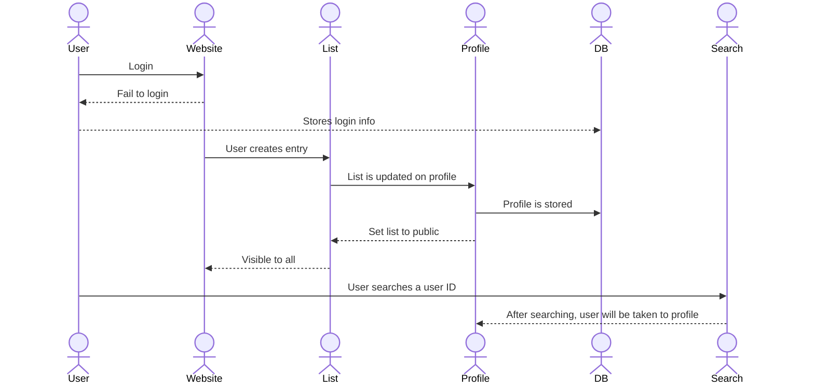

# Koob

[My Notes](notes.md)

A brief description of the application here. Lorem ipsum dolor sit amet, consectetur adipiscing elit, sed do eiusmod tempor incididunt ut labore et dolore magna aliqua. Ut enim ad minim veniam, quis nostrud exercitation ullamco laboris nisi ut aliquip ex ea commodo consequat. Duis aute irure dolor in reprehenderit in voluptate velit esse cillum dolore eu fugiat nulla pariatur. Excepteur sint occaecat cupidatat non proident, sunt in culpa qui officia deserunt mollit anim id est laborum.

> [!NOTE]
>  This is a template for your startup application. You must modify this `README.md` file for each phase of your development. You only need to fill in the section for each deliverable when that deliverable is submitted in Canvas. Without completing the section for a deliverable, the TA will not know what to look for when grading your submission. Feel free to add additional information to each deliverable description, but make sure you at least have the list of rubric items and a description of what you did for each item.

> [!NOTE]
>  If you are not familiar with Markdown then you should review the [documentation](https://docs.github.com/en/get-started/writing-on-github/getting-started-with-writing-and-formatting-on-github/basic-writing-and-formatting-syntax) before continuing.

## 🚀 Specification Deliverable

> [!NOTE]
>  Fill in this sections as the submission artifact for this deliverable. You can refer to this [example](https://github.com/webprogramming260/startup-example/blob/main/README.md) for inspiration.

For this deliverable I did the following. I checked the box `[x]` and added a description for things I completed.

- [x] Proper use of Markdown
- [x] A concise and compelling elevator pitch
- [x] Description of key features
- [x] Description of how you will use each technology
- [x] One or more rough sketches of your application. Images must be embedded in this file using Markdown image references.

### Elevator pitch

Have you ever wanted a simple, conveneient way to not only rate what you read, but see what other people think about the same book? Introducing Koob, a website where you can upload any and all books, comics, poetry, and more, all to be rated and even commented on by the user. Unlike other rating sites, this gives complete freedom for uploads, allowing for all literature to be included, as well as a personal ranking system, where you can compile a list of all of your favorite media and how they rank amongst others of their type.

### Design

This would be the design flow of the website:

### Key features
- Able to create an entry for any piece of media and rate it
- Images associated with each entry
- Able to create a list of any one type of media and rank each entry in the list
- Able to add a numerical rating to each entry, as well as a comment

### Technologies

I am going to use the required technologies in the following ways.

- **HTML** - The structure of the weebsite will be as follows: Across the very top will be the title of the website. A little below that will be a header, telling which section of the website someone is in (i.e., Upload, List, etc.). Then, a small paragraph outlining what goes on in each link (i.e., the upload section would have something like "Choose a title for your work, as well as a picture, and then give it a ranking and/or a comment!"). HTML will be used to display whatever image the user uploads as part of the entry. Finally, on a bar across the top will be the links created by HTML to take the user to the different sections of the site. Thesse will include "Entry/upload" to make a new entry, "Lists" to show all the lists a user has created and be able to edit them, and "Profile" to show the users site information, as well as their lists publicly (unless specified otherwise). There will be a search bar to find specific users and their profiles.

- **CSS** - I will use Lucida Console fixed font throughout the website. I will use a dark forest green, white, and a gold-ish yellow. The buttons will be rectangular, with rounded corners. There will be partitions between each of the links, as well as the header and title. This will also allow for me to change the color of the font for the rating itself (which will be 1-10), with each rating being a different color, progressing from red (at 1) up to green (at 10).

- **React** - I will use react for a react router, which will let me have the multiple pages that I would need for each of the links. I will have a tally that will update with each new entry, showing how many a user has for each list. In the lists section, there will be an option to edit or delete an entry. There will also be a way to login. Lists can also be set to public or private.

- **Service** - Backend service with endpoints for:
    - Login
    - Submitting entry
    - Receiving entry
    - Updating lists publically and privately

- **DB/Login** - This will store the users, entries, and lists. It will allow users to register and login. Credentials will be securely stored in the database. Entries cannot be created unless the user is logged in. Lists associated with users will also be stored in the database.

- **WebSocket** - As the users create entries, they will be public on their profiles for others to view via searching the profile.

## 🚀 AWS deliverable

For this deliverable I did the following. I checked the box `[x]` and added a description for things I completed.

- [ ] **Server deployed and accessible with custom domain name** - [My server link](https://yourdomainnamehere.click).

## 🚀 HTML deliverable

For this deliverable I did the following. I checked the box `[x]` and added a description for things I completed.

- [ ] **HTML pages** - I did not complete this part of the deliverable.
- [ ] **Proper HTML element usage** - I did not complete this part of the deliverable.
- [ ] **Links** - I did not complete this part of the deliverable.
- [ ] **Text** - I did not complete this part of the deliverable.
- [ ] **3rd party API placeholder** - I did not complete this part of the deliverable.
- [ ] **Images** - I did not complete this part of the deliverable.
- [ ] **Login placeholder** - I did not complete this part of the deliverable.
- [ ] **DB data placeholder** - I did not complete this part of the deliverable.
- [ ] **WebSocket placeholder** - I did not complete this part of the deliverable.

## 🚀 CSS deliverable

For this deliverable I did the following. I checked the box `[x]` and added a description for things I completed.

- [ ] **Header, footer, and main content body** - I did not complete this part of the deliverable.
- [ ] **Navigation elements** - I did not complete this part of the deliverable.
- [ ] **Responsive to window resizing** - I did not complete this part of the deliverable.
- [ ] **Application elements** - I did not complete this part of the deliverable.
- [ ] **Application text content** - I did not complete this part of the deliverable.
- [ ] **Application images** - I did not complete this part of the deliverable.

## 🚀 React part 1: Routing deliverable

For this deliverable I did the following. I checked the box `[x]` and added a description for things I completed.

- [ ] **Bundled using Vite** - I did not complete this part of the deliverable.
- [ ] **Components** - I did not complete this part of the deliverable.
- [ ] **Router** - I did not complete this part of the deliverable.

## 🚀 React part 2: Reactivity deliverable

For this deliverable I did the following. I checked the box `[x]` and added a description for things I completed.

- [ ] **All functionality implemented or mocked out** - I did not complete this part of the deliverable.
- [ ] **Hooks** - I did not complete this part of the deliverable.

## 🚀 Service deliverable

For this deliverable I did the following. I checked the box `[x]` and added a description for things I completed.

- [ ] **Node.js/Express HTTP service** - I did not complete this part of the deliverable.
- [ ] **Static middleware for frontend** - I did not complete this part of the deliverable.
- [ ] **Calls to third party endpoints** - I did not complete this part of the deliverable.
- [ ] **Backend service endpoints** - I did not complete this part of the deliverable.
- [ ] **Frontend calls service endpoints** - I did not complete this part of the deliverable.
- [ ] **Supports registration, login, logout, and restricted endpoint** - I did not complete this part of the deliverable.

## 🚀 DB deliverable

For this deliverable I did the following. I checked the box `[x]` and added a description for things I completed.

- [ ] **Stores data in MongoDB** - I did not complete this part of the deliverable.
- [ ] **Stores credentials in MongoDB** - I did not complete this part of the deliverable.

## 🚀 WebSocket deliverable

For this deliverable I did the following. I checked the box `[x]` and added a description for things I completed.

- [ ] **Backend listens for WebSocket connection** - I did not complete this part of the deliverable.
- [ ] **Frontend makes WebSocket connection** - I did not complete this part of the deliverable.
- [ ] **Data sent over WebSocket connection** - I did not complete this part of the deliverable.
- [ ] **WebSocket data displayed** - I did not complete this part of the deliverable.
- [ ] **Application is fully functional** - I did not complete this part of the deliverable.
